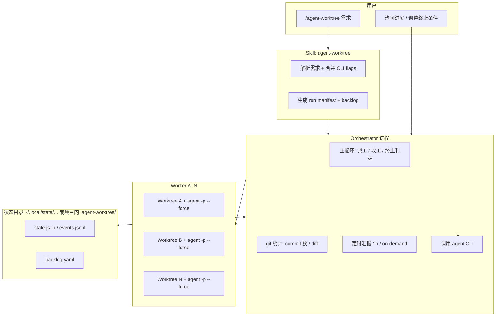

# Agent Worktree 编排：Orchestrator + 多 Worker（Cursor CLI）

**文档目的**：定义一套以 **Cursor Agent CLI**（命令 `agent`，见 [Using Agent in CLI](https://cursor.com/docs/cli/using) 与 [Headless CLI](https://cursor.com/docs/cli/headless)）为唯一执行面的 **Orchestrator / Worker** 流水线，满足：可配置 Worker 数量、可配置终止条件、定时与按需进度同步、通过 **Skill + `/agent-worktree`** 一键启动，并能在需求驱动下把大目标细化到 **≥100 次 commit 粒度** 的持续交付节奏。

**非目标**：不在本文档内实现具体代码；落地实现时应单独开分支并按仓库 `AGENTS.md` / `scripts/verify.sh` 走 PR。

---

## 1. 目标与原则

| 原则 | 说明 |
|------|------|
| **CLI 为唯一调度面** | Orchestrator 与每个 Worker 的“干活”均通过调用 `agent`（非交互：`agent -p` / `--print`，改文件：`--force`）完成；可选 `--output-format json` 或 `stream-json` 供编排器解析。 |
| **Worktree 隔离** | 每个 Worker 绑定独立 Git worktree（`agent --worktree "<prompt>"` 或 `--workspace <repo>`），避免多代理同时改同一工作区。参考官方：[CLI worktrees](https://cursor.com/docs/cli/using#cli-worktrees)。 |
| **配置优于写死** | Worker 个数、终止条件（commit 上限、墙钟时间、人工停止）全部由 **需求文本 + 显式 CLI 参数** 解析得到默认值与覆盖值。 |
| **可观测** | 默认 **每 1 小时** Orchestrator 向用户输出各 Worker 进展；用户随时询问时读取同一套状态并回答。 |
| **可复用入口** | 整个流水线封装为一个 **Cursor Agent Skill**；用户在 CLI 中输入 `/agent-worktree <需求>` 即启动（Skill 内说明具体安装路径与前置条件）。 |

---

## 2. 架构总览



- **Orchestrator**：单进程（或单主进程 + 子 shell），负责解析配置、维护 backlog、为每个 Worker 构造 **短 prompt**、调用 `agent`、解析结果、更新状态、判定是否结束、写日志与定时摘要。
- **Worker A/B/…**：不单独常驻；每次小任务是一次 `agent` 子进程，在各自 worktree 中完成 **一个可验收 micro-task**（见第 7 节），退出后由 Orchestrator 派发下一任务。

---

## 3. Cursor CLI 调用契约（Orchestrator / Worker）

以下命令名与参数以官方文档为准；若 CLI 升级导致参数变更，以 [Cursor CLI 文档](https://cursor.com/docs/cli/overview) 为准，编排层只做 **薄封装**（统一 `run_agent.sh` 或等价 TS/Python 包装）。

### 3.1 Worker 执行一次小任务（典型）

```bash
# 在指定仓库根下，为 Worker k 使用独立 worktree 执行非交互任务并落盘修改
agent -p --force --output-format json \
  --workspace "/path/to/repo" \
  --worktree "$(cat prompt_worker_k.txt)"
```

要点：

- **`-p` / `--print`**：非交互，适合脚本编排。
- **`--force`**：在 print 模式下允许真实写文件（否则可能只“提议”不应用）。见 [Headless CLI](https://cursor.com/docs/cli/headless)。
- **`--workspace`**：显式仓库根，避免 cwd 歧义。
- **`--worktree`**：在 `~/.cursor/worktrees` 规则下创建/使用隔离编辑区；多 Worker 并行时 **每个 Worker 固定一个逻辑分支名 + worktree 路径**（实现层在 manifest 中记录）。
- **`--output-format json`**：Orchestrator 解析 `summary / result / error`；需要流式观测时用 `stream-json`（见官方 headless 示例）。

### 3.2 Orchestrator 自身“思考 / 规划”也可用 CLI

Orchestrator 的“大脑”可以是：

1. **同一机器上的 `agent -p`**（推荐与 Worker 一致，全部 CLI）；或  
2. 本地 LLM / 规则引擎（不推荐首版，增加维护面）。

首版建议：**规划与任务拆分**也调用 `agent --mode=plan` 或普通 `agent -p` 专门角色 prompt：“只输出 YAML/JSON backlog，不要改代码”。

### 3.3 认证

Headless 场景需 **`CURSOR_API_KEY`**（见 [Headless 文档](https://cursor.com/docs/cli/headless#setup)）。Skill 与 README 中必须写明：未设置则 Orchestrator 拒绝启动并给出 Dashboard 链接。

---

## 4. Worker 数量：不写死，默认 2，需求驱动扩展

### 4.1 配置来源（优先级从高到低）

1. **CLI 显式参数**：例如 `--workers 3`。
2. **需求自然语言解析**（启发式，可迭代）：匹配模式如  
   - “三位 / 三个 agent / 三名 / 三个角色 / 分别负责 …”  
   - 枚举角色：“负责建图”“负责导航”“负责测试” → `workers = 3` 且 **角色标签** 写入 manifest。
3. **默认值**：若以上皆无，**`workers = 2`**（Worker A / B）。

### 4.2 角色（Role）与 Worker 映射

当需求中显式出现多个职责时：

- 为每个职责生成 `role_id`：`mapping` | `navigation` | `perception` | `qa` | …  
- `workers` 数量与 `role_id` 列表 **长度一致**；若只说了人数没说角色，则 Orchestrator 先用一次 `agent -p` 生成角色表（JSON），用户可在启动日志中确认。

### 4.3 并行度

- **默认**：所有 Worker **可并行**派发 `agent`（受机器资源与 Cursor 并发策略限制；实现层应设 `max_parallel` 安全上限，例如 3，**可配置**）。
- 若需求写明“必须串行”（例如共享同一硬件模拟器），Orchestrator 读取后 `max_parallel = 1`。

---

## 5. 结束方式：不写死，默认 100 commits，可组合条件

### 5.1 终止条件模型（建议 `policy` 对象）

| 条件类型 | 含义 | 默认 |
|----------|------|------|
| `max_total_commits` | 从 run 基线起，全 repo（或指定前缀路径）累计 **新 commit** 数上限 | `100` |
| `max_wall_clock_sec` | 墙钟时间上限 | **不设**（可选） |
| `max_worker_rounds` | 每 Worker 的派发轮数上限 | **不设**（可选） |
| `backlog_empty` | backlog 全部 **done** 且无阻塞 | 若启用则优先正常结束 |
| `manual_stop` | 用户 `SIGINT` / `agent-worktree stop` | 始终支持 |

**逻辑**：`(backlog_empty && require_clean_backlog) OR max_total_commits OR max_wall_clock_sec OR max_worker_rounds OR manual_stop` 中任一满足即停（实现时明确 **OR 优先级** 与日志）。

### 5.2 从需求中解析覆盖值

启发式示例（仅说明意图，非正则定稿）：

- “至少 200 次 commit” → `max_total_commits = 200`
- “跑满 24 小时” → `max_wall_clock_sec = 86400`
- “每人至少 50 轮” → `max_worker_rounds = 50`（按 Worker 维度计数）

未提及则 **仅使用默认** `max_total_commits = 100`。

### 5.3 Commit 计数口径

- **基线**：run 开始时记录 `baseline_sha` 与可选 `scope_paths`（只统计 `dimos/navigation/**` 等路径下的 commit）。
- **计数**：`git rev-list --count baseline..HEAD`（在各自 worktree merge 回集成分支前，可先按各 worktree 分支计数再汇总；实现层二选一并在文档中固定一种，避免双计）。

---

## 6. 进度汇报：每 1 小时 + 用户询问时

### 6.1 状态存储（Orchestrator 写，用户 / Skill 读）

建议目录（二选一，实现时固定一种）：

- 项目内：`<repo>/.agent-worktree/<run-id>/`
- 用户态：`~/.local/state/agent-worktree/<run-id>/`

**最小文件集**：

| 文件 | 内容 |
|------|------|
| `manifest.json` | `run_id`, `workers`, `roles`, `policy`, `workspace`, `created_at` |
| `backlog.yaml` | 史诗 → 主题 → 任务树 + 状态 `todo/doing/done/blocked` |
| `workers/*.json` | 每 Worker：`current_task_id`, `last_prompt_hash`, `last_agent_exit_code`, `last_summary`, `commits_since_baseline`, `last_finished_at` |
| `events.jsonl` | 每行一个事件：`dispatch`, `agent_exit`, `merge`, `hourly_tick`, `user_query` |

### 6.2 定时 1 小时

Orchestrator 主循环内：

- 维护 `next_status_at = now + 3600`。
- 触发时向 **stdout 与用户指定输出通道**（如 `status.md` 或 TUI）写入结构化摘要：每个 Worker 当前任务、最近完成项、commit 增量、阻塞项、距离终止条件还剩多少。

### 6.3 用户询问时

两种等价机制（实现可选一或都做）：

1. **CLI 子命令**：`agent-worktree status --run <id>` 读取 `manifest + workers/*.json` 打印人类可读报告。  
2. **同一终端里 Orchestrator 仍在跑**：用户键入 `status` / 第二个终端发信号 —— 首版推荐子命令，最简单。

> 说明：用户在 **Cursor CLI 的交互 Agent** 里 @Orchestrator 或运行 status 子命令，都应得到 **同一数据源**，避免两套真相。

---

## 7. Skill：`/agent-worktree` 启动整条流水线

### 7.1 Skill 应包含的内容（规范层）

- **名称**：如 `agent-worktree`（文件名 `SKILL.md` 放用户全局 skills 目录，见 Cursor Agent Skills 约定）。
- **触发**：用户在 CLI 输入 **`/agent-worktree <需求全文>`**（或带 flags：`/agent-worktree --workers 3 …`）。
- **行为**：
  1. 校验 `agent` 在 `PATH`、`CURSOR_API_KEY` 存在。
  2. 解析需求 → 生成 `manifest.json` + 初始 `backlog.yaml`（可先跑一次 **规划专用** `agent -p`，`--mode=plan` 若可用）。
  3. `exec` / `spawn` Orchestrator 主进程（bash / node / uv run 均可），并把 `run_id` 打印给用户。
  4. Skill 文档中给出 **停止 / 状态 / 续跑** 命令约定。

### 7.2 与「仅文档」的边界

Skill **不负责**实现 Orchestrator 逻辑；Skill 负责 **把用户一句话引导到已安装的 orchestrator 入口**。真正的 `orchestrator` 可放在本仓库 `scripts/agent-worktree/` 或独立 small package。

---

## 8. 任务分解：如何把大需求变成「≥100 commits」节奏

核心思想：**不要把「100 次 commit」当作一次任务**，而是把 backlog 设计成 **大量可独立合并的小变更**，每个小任务强迫 1 个（或少数）逻辑一致的 commit。

### 8.1 三层 backlog

1. **Epic**（史诗）：对齐用户大目标，例如「四足机器人：导航 + 目标检测」。  
2. **Theme**（主题）：建图 / 定位 / 规划 / 控制接口 / 数据集 / 评测 / 文档 / CI 等。  
3. **Micro-task**（派发单元，对应一次 `agent --worktree`）：必须满足  
   - 可在一轮 headless 内尽力完成；  
   - 有 **验收标准**（测试命令、lint、或「新增文件 X 存在」）；  
   - 鼓励 Worker 在本轮结束时 **`git commit`** 一次（message 带 `task_id`）。

Orchestrator 每派发一次，**commit 计数 +1 期望**；实际以 `git` 为准，防止空转。

### 8.2 Orchestrator 派工循环（伪代码）

```
init manifest, backlog, baseline_sha
while not should_stop(policy, backlog, git_stats):
  for each worker in eligible_workers(max_parallel):
    task <- pick_next_task(backlog, worker.role, deps)
    if task is nil: continue
    mark task doing
    prompt <- render_prompt(task, worker, repo_rules)
    run: agent -p --force ... --worktree prompt
    if success:
      mark task done; record summary; maybe merge to integration branch
    else:
      mark blocked or retry with narrowed prompt
  sleep short_interval
  if hourly_due: emit_status_report()
```

### 8.3 任务依赖与冲突避免

- **同主题同文件**：尽量串行同一 `codeowner_path`；不同主题可并行不同子树。  
- **集成点**：设定 `integration_branch`，Worker 完成后发 PR 或由 Orchestrator `git merge --no-ff`（团队规范决定）；plan 层只要求 **有明确集成步骤**。

---

## 9. 实例（用户给定）：`/agent-worktree` 给机器狗增加导航与目标检测；三个 Agent：建图、导航、目标感知

以下说明 **Orchestrator 如何想、如何拆、如何调 CLI、如何在小任务完成后更新任务** —— 与真实 DimOS 模块名无关，重点是 **编排方法**。

### 9.1 用户输入（示例）

```text
/agent-worktree 给机器狗增加导航和目标检测模块，分配给三个 agent 实现：
建图 agent、导航 agent、目标感知 agent。
至少完成 100 次有意义的提交，并跑通离线回放场景下的端到端演示。
```

解析结果（说明性）：

- `workers = 3`，`roles = [mapping, navigation, perception]`  
- `max_total_commits >= 100`（需求明说；若只说「至少一百次 commit」则 policy 覆盖默认 100）  
- `parallel = true`（未要求串行）

### 9.2 Orchestrator 首轮：生成 backlog（规划 `agent` 调用）

Orchestrator 调用一次 **只规划不改代码** 的 CLI，例如：

```bash
agent -p --output-format json --mode=plan \
  --workspace "/path/to/dimos" \
  "根据下列目标输出 ONLY JSON：{ epics, themes, tasks[] }
  每个 task 含 id, title, role, acceptance, deps, est_commits }.
  目标：四足机器人导航 + 目标检测；三角色并行；需 >=100 可独立提交的任务粒度建议。"
```

将 JSON **落盘为 `backlog.yaml`**（或转换），并人工/自动校验：`len(tasks)` 是否覆盖足够 commit 机会（若不足，Orchestrator 再请求「补全 tasks 至 ≥120」）。

### 9.3 角色分工（逻辑上如何分配）

| 角色 | 主要负责的主题（示例） | 与其它角色的接口 |
|------|------------------------|------------------|
| 建图 / mapping | 传感器输入、占据栅格/点云地图、地图服务 API、持久化格式 | 输出给 navigation：`map_frame`、静态层更新接口 |
| 导航 / navigation | 全局/局部规划、代价地图、行为状态机、与底盘控制对接 | 消费 mapping；给 perception 留「障碍物语义层」可选钩子 |
| 目标感知 / perception | 检测器管线、跟踪、语义目标列表、可视化与日志 | 输出给 navigation：动态障碍物或 `ObjectHypothesis` 流 |

Orchestrator **不是**一次把整表扔给某个 Worker；它每次只发 **一个 `task_id`** 的 prompt 模板，例如：

```text
你是 Worker PERCEPTION-01，只在 worktree 内修改。
任务 ID: P-014
目标: 增加「相机时间同步检查」单元测试，路径 scope: perception/...
验收: uv run pytest perception/tests/test_time_sync.py -q 通过。
约束: 单 commit，message: "test(perception): time sync (P-014)"。
完成后在回复 JSON 中给出: { "status": "done|blocked", "summary": "...", "files_touched": [...] }。
```

### 9.4 如何将「大功能」细化到 **至少 100 次 commit**

把每个主题再拆为 **可垂直切分** 的微任务，示例数量级（非真实文件）：

- **建图（~35 commits）**：接口骨架、消息类型、空实现、单元测试、回放适配、参数配置、日志、边界情况、refactor、文档页、benchmark 小步等。  
- **导航（~35 commits）**：代价地图一层层加、规划器 stub、启发式、集成测试、失败恢复、与 replay 对齐、性能、文档。  
- **感知（~35 commits）**：模型加载 stub、前后处理、NMS、跟踪 ID、评测脚本、可视化、错误处理、文档。

Orchestrator 维护 **任务依赖**：例如「导航消费地图」→ 先完成 mapping 的 `MapProvider` 接口任务后，才派发 navigation 的集成任务。

### 9.5 调度 Worker 的实际命令形态（示意）

**Worker「导航」第 12 个小任务**：

```bash
agent -p --force --output-format json \
  --workspace "/path/to/dimos" \
  --worktree "$(printf '%s' "$NAV_PROMPT")"
```

其中 `$NAV_PROMPT` 内含：`task_id`, `scope paths`, `acceptance`, `单 commit 要求`, `禁止修改其它角色拥有的目录`（通过 `.cursor/rules` 或 prompt 边界声明）。

### 9.6 每完成一个小任务后，如何更新下一任务

1. Orchestrator 解析 `agent` 返回 JSON（或从 worktree 内读取 Worker 写出的 `task_result.json` —— 可作为补充协议）。  
2. 若 `status == done`：`backlog` 中该 `task_id` → `done`，`workers/nav.json` 更新 `last_summary`、`commits_since_baseline++`。  
3. **选择下一任务**：在 `role=navigation` 且 `deps` 已满足的任务中，按优先级/拓扑序取下一个 `todo` → 标记 `doing` → 再派发下一轮 `agent`。  
4. 若 `blocked`：Orchestrator 记录阻塞原因，可 **切换**到其它 Worker 任务或 **自动生成**「解锁子任务」（例如缺接口则给 mapping 派「添加空接口」任务）。

### 9.7 一小时进展报告（示例片段）

```text
[run abc123] 已过 3h00m | commits: 27/100 | backlog: 84 todo, 12 doing, 24 done

Worker MAPPING (role mapping):
  doing: M-009 占据栅格边界外扩参数化
  last_done: M-008 回放 lidar 对齐单元测试 (commit 3f1a2b1)

Worker NAVIGATION:
  doing: N-011 接入全局 costmap 只读接口
  blocked: 无

Worker PERCEPTION:
  doing: P-010 YOLO 后处理 NMS 抽函数
  last_done: P-009 增加空模型 stub (commit 9aa118c)

下一整点报告: 2026-05-09T18:00:00+08:00
```

用户在中途问「现在怎样？」—— Orchestrator（或 `agent-worktree status`）读取同一 `state` 输出与上表同构内容即可。

---

## 10. 风险与对策

| 风险 | 对策 |
|------|------|
| `agent` 在 print 模式需 `--force` 才真正写文件 | Skill 与 Orchestrator 默认加 `--force`；仅「纯规划」子命令不加。 |
| 多 worktree / 合并冲突 | 强制定小 scope；集成任务单独角色或串行阶段；冲突时自动生成「解决冲突」高优先级任务。 |
| CLI 对 shell 命令的 **人工批准** | 官方说明交互模式下会询问；headless `--print` 下行为以当前 CLI 版本为准 —— 若仍卡住，prompt 中要求 **少调用需批准命令** 或预置非交互 flag（随文档更新）。 |
| `~/.cursor/worktrees` 清理策略 | 长跑任务定期 `manifest` 记录路径；结束显式归档或提示用户。 |
| 把「100 commits」做成无意义碎 commit | acceptance 必须绑定 **测试/行为/文档**；Orchestrator 可拒绝 `files_touched` 为空的成功声称。 |

---

## 11. 落地实现清单

**已入库（骨架）**

| 路径 | 说明 |
|------|------|
| `scripts/agent-worktree/orchestrator.py` | `start` / `status` 子命令、策略与需求启发式、`agent` argv 构造、`.agent-worktree/<run-id>/` 状态、定时 `last_status.json`、占位 backlog。 |
| `scripts/agent-worktree/run.sh` | 仓库根下 `uv run python …/orchestrator.py` 入口。 |
| `.cursor/skills/agent-worktree/SKILL.md` | 项目内 Skill（显式加载）；含启动与 `status` 说明。 |
| `.cursor/commands/agent-worktree.md` | Cursor `/agent-worktree` 斜杠命令，驱动上述脚本。 |

**后续 PR 建议**

1. `scripts/agent-worktree/lib/prompt_templates`：Worker / Planner 模板分离。  
2. 单元测试：`parse_workers_from_requirement` / `parse_max_commits_from_requirement` 等（`dimos` 的 `testpaths` 下加小测即可）。  
3. 解析 `agent --output-format json` 的返回并驱动 backlog，而非仅靠退出码。

---

## 12. 变更记录

| 日期 | 说明 |
|------|------|
| 2026-05-09 | 初版：CLI 全编排、可配置 Worker/终止条件、1h 进展、Skill 入口、三角色实例与 ≥100 commit 拆解方法。 |
| 2026-05-09 | 增加骨架实现路径与仓库内 `scripts/agent-worktree`、`Skill`、`/agent-worktree` 命令。 |
